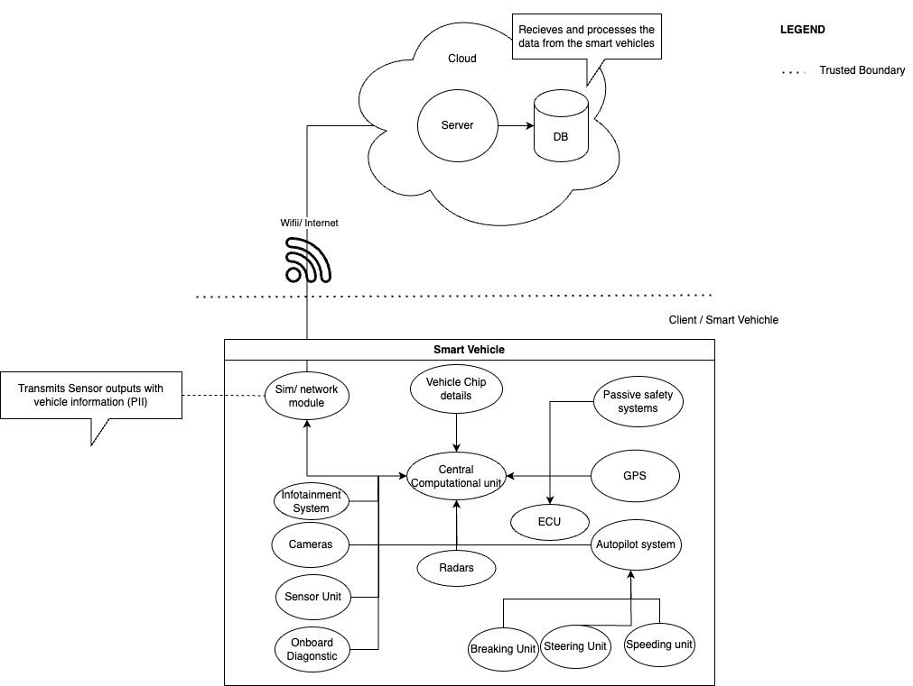
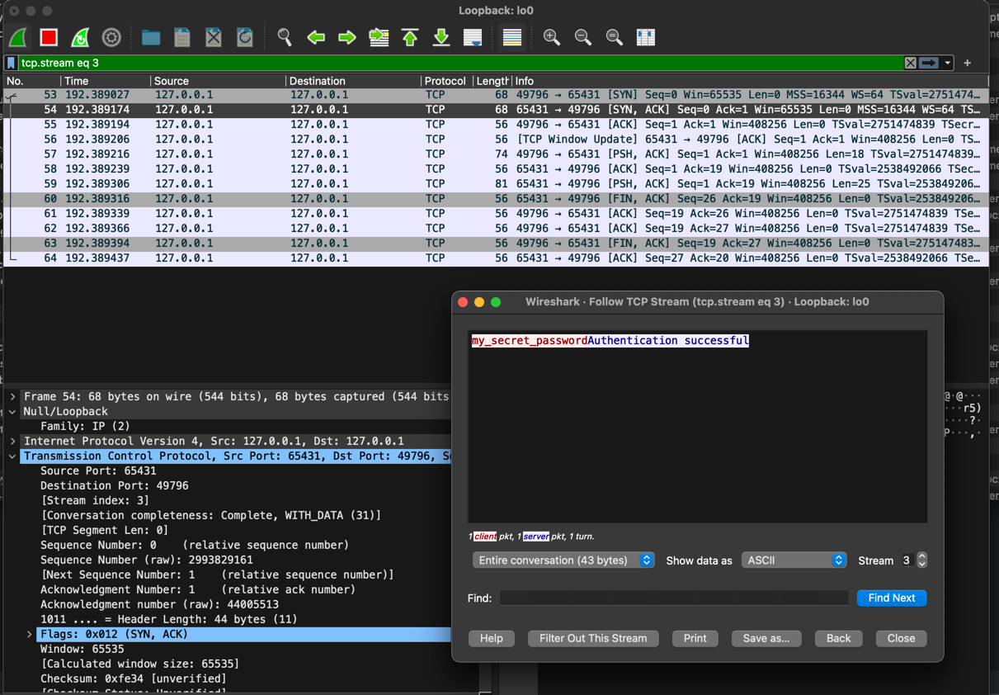
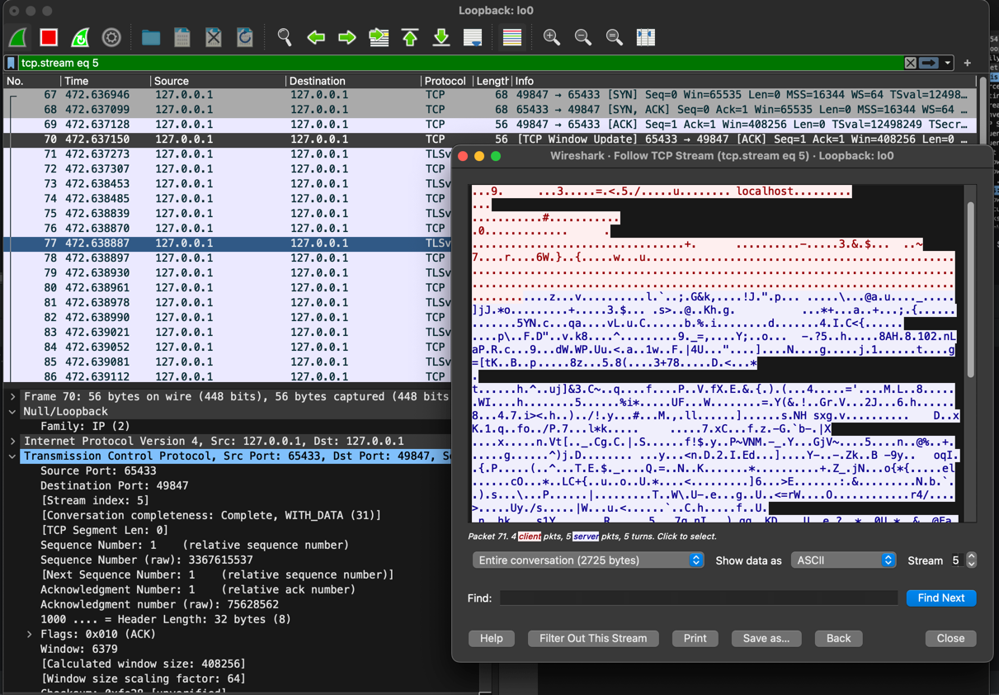
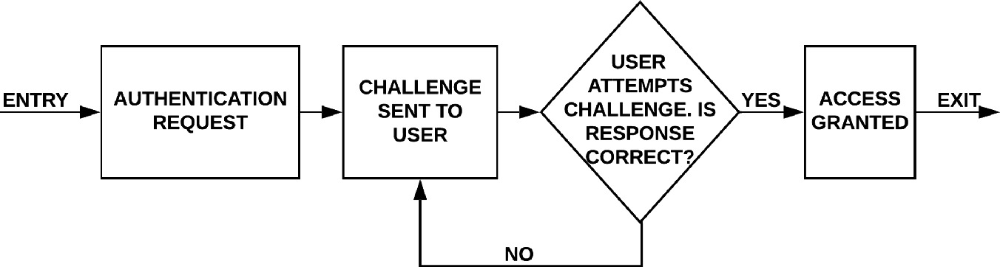

# Smart-Vehicle-Server-Simulator
# Getting Started 🚀

### Prerequisites for running the application
* <a href=https://www.python.org/downloads/release/python-390/> Python 3.9 or Greater</a>
* <a href=https://pip.pypa.io/en/stable/installation/> pip 23.1.2 or Greater</a>
After installing the requirements, run the following commands in order

```bash
# creates python virtual environment for the project
python -m venv ./venv 

# activates virtual environment; this is on Mac or Linux
source ./venv/bin/activate 

# This is for windows (Using Powershell)
.\venv\Scripts\activate.bat 

# upgrade pip to get the latest packages
python -m pip install --upgrade pip 

#Is used to check if the virtual environment is being used 
pip3 -V  

# Install all required dependencies
pip3 install -r requirements.txt 
```
Python applications which simulates the communication between a smart car and a cloud server the data-flow-diagram show
the system which this project is trying to simulate.


Figure 1: DFD Diagram

## Hypothesis

This project delves into the hypothesis: 
```
Is it more secure and effective to use passwords or use passwordless authentication to
communicate with the server.
```

### Using Password as a means of authentication
The python file ```server_ssl.py``` mimics the server as shown in the DFD in Figure 1, which stores the password in an 
hashed format using Argon2-id algorithm using RFC 9106 with High memory recommended parameters, that is resistant to GPU-based attacks
, rainbow-table and side-channel attacks (Biryukov, A., Dinu, D, 2016).

```python
# hashes the password into argon2id with random salt
# Using the first recommendation per RFC 9106 with High memory.
HASHED_SECRET = '$argon2id$v=19$m=2097152,t=1,p=4$vT7UexZFsNYigbn2flmJRg$yIOPV3spwnNUIvfFb4B7EMSDh31E3u2C5DOc7Kplljs'
```
#### Issue for password authentication


### Passwordless Authentication Analysis
### Generated private and public keys for passwordless authentication
In order to carry out passwordless authentication a symmetric key-based protocol (public and private key) for a
passwordless authentication. This method of symmetric authentication (passwordless) is straightforward and is resilient to many
known attacks like Man-in-the-Middle, and brute-force attacks (Bruce, N. and Lee, H.J., 2014). This method provides a simple
way for authentication which would be feasible for most low-resourced IoT devices.

````bash
## How to generate keys for passwordless authentication Source (OpenSSL Project, 2021)
openssl genpkey -algorithm RSA -out client_private_key.pem
openssl pkey -in client_private_key.pem -pubout -out client_public_key.pem
````

#### Issue for passwordless
However, one of the main challenges for this
type of authentication is the size of the certificates/keys which have a rather complex structure and is resource intensive, which would create
difficulties in processing and verifying them as the IoT devices have very limited resources (Schukat, M. and Cortijo, P., 2015).


# Additional Mitigations applied

### SSL/TLS
* Use of secure encrypted protocols like SSL to transmit the data between client and the server. This is achieved by using the TLS/SSL
wrapper provided by python which uses the TLSv1.3 with OpenSSL v1.1.1 (Python Software Foundation, 2023).
  #### Test for Man-in-the-middle
    * Two test scenarios were applied where the client-server connection was in plain text and the other encrypted with
      its corresponding certificates.
      Wireshark as a tool was used to intercept the data packets during communications and packets were inspected using TCP Stream function (Wireshark (n.d.)).
      Legend :

    * | Host | Port | Description | Protocol | Figure |
      |-----------------------|-------|-------------|----------|--------|
      | localhost (127.0.0.1) | 65431 | Uencrpyted  | TCP | 1 |
      | localhost (127.0.0.1) | 65433 | Encrypted   | TCP | 2 |

     
      Figure X shows that the TCP stream between the client and server is in clear text and MITM attacks can be easily
      carried out.
  
* 
     
      Figure X shows that the TCP stream between the client and server is in encrypted form and the connection is not in
      clear text strengthening our
      communication against MITM attacks.
* **Note: The certificates generated here are just for testing purposes and are self-signed which can be compromised and should not 
be used to secure devices instead use a validated certificate from a trusted source.**

### Use of Challenge–Response Authentication Mechanism
The code uses additional security measures such as random challenge sent to the client and back to the server to which creates a unique
session between the two parties and even if the data is intercepted, the data cannot be reused as the server also expects the random challenge, protecting it 
from various attacks like replay-attacks (Kushwaha et al. 2021).


(Kushwaha et al. 2021)
# Reference
* Biryukov, A., Dinu, D., & Khovratovich, D. (2021). The Memory-Hard Argon2 Password Hash Function. RFC 9106. IETF. Available from: https://datatracker.ietf.org/doc/rfc9106/
* Bruce, N. and Lee, H.J., 2014, February. Cryptographic computation of private shared key based mutual authentication protocol: Simulation and modeling over wireless networks. In The International Conference on Information Networking 2014 (ICOIN2014) (pp. 578-582). IEEE.
* Kushwaha, P., Sonkar, H., Altaf, F. and Maity, S., 2021. A brief survey of challenge–response authentication mechanisms. ICT Analysis and Applications: Proceedings of ICT4SD 2020, Volume 2, pp.573-581.
* OpenSSL Project, 2021. OpenSSL Man Pages: Version 3.1. OpenSSL Software Foundation. Available from: https://www.openssl.org/docs/man3.1/man1/ [Accessed 19 October 2023].
* Python Software Foundation, 2023. ssl — TLS/SSL wrapper for socket objects. Available at: https://docs.python.domainunion.de/3/library/ssl.html [Accessed 22 October 2023].
* Schukat, M. and Cortijo, P., 2015, June. Public key infrastructures and digital certificates for the Internet of things. In 2015 26th Irish signals and systems conference (ISSC) (pp. 1-5). IEEE.
* Wireshark (n.d.) 6.5.2. The “Follow TCP Stream” dialog box. Available from: https://www.wireshark.org/docs/wsug_html_chunked/ChAdvFollowStreamSection.html (Accessed: [21 Oct 2023])