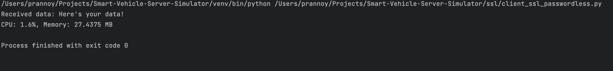
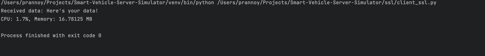
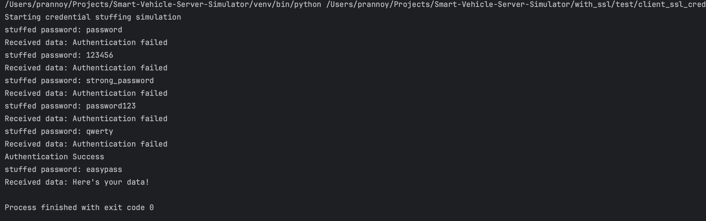
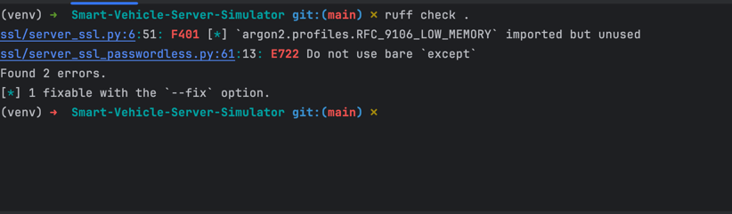
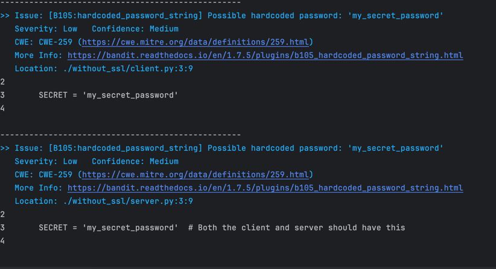

# Smart-Vehicle-Server-Simulator
# Getting Started 🚀

### Prerequisites for running the application
* <a href=https://www.python.org/downloads/release/python-390/> Python 3.9 or Greater</a>
* <a href=https://pip.pypa.io/en/stable/installation/> pip 23.1.2 or Greater</a>
After installing the requirements, run the following commands in order

```bash
# creates python virtual environment for the project
python -m venv ./venv 

# activates virtual environment; this is on Mac or Linux
source ./venv/bin/activate 

# This is for windows (Using Powershell)
.\venv\Scripts\activate.bat 

# upgrade pip to get the latest packages
python -m pip install --upgrade pip 

#Is used to check if the virtual environment is being used 
pip3 -V  

# Install all required dependencies
pip3 install -r requirements.txt 
```
### How to run the code
Running server client without SSL
```bash
# To start server without ssl 
cd without_ssl
python server.py
```

```bash
# To start server without ssl 
cd without_ssl
python client.py
```

Running server client with SSL and using password authentication
```bash
# To start server with ssl 
cd with_ssl
python server_ssl.py
```

```bash
# To start server with ssl 
cd with_ssl
python client_ssl.py
```

Running server client with SSL and using passwordless authentication
```bash
# To start server with ssl 
cd with_ssl
python server_ssl_passwordless.py
```

```bash
# To start server with ssl 
cd with_ssl
python client_ssl_passwordless.py
```

Python applications which simulates the communication between a smart car and a cloud server the data-flow-diagram show
the system which this project is trying to simulate.

### Model Specification under test

Figure 1: DFD Diagram

## Hypothesis

This project delves into the hypothesis: 
```
Is it more secure and effective to use passwords or use passwordless authentication to
communicate with the server.
```

### Using Password as a means of authentication
The python file ```server_ssl.py``` mimics the server as shown in the DFD in Figure 1, which stores the password in an 
hashed format using Argon2-id algorithm using RFC 9106 with High memory recommended parameters, that is resistant to GPU-based attacks
, rainbow-table and side-channel attacks (Biryukov, A., Dinu, D, 2016).

```python
# hashes the password into argon2id with random salt
# Using the first recommendation per RFC 9106 with High memory.
HASHED_SECRET = '$argon2id$v=19$m=2097152,t=1,p=4$vT7UexZFsNYigbn2flmJRg$yIOPV3spwnNUIvfFb4B7EMSDh31E3u2C5DOc7Kplljs'
```
#### Issue for password authentication


### Passwordless Authentication Analysis
### Generated private and public keys for passwordless authentication
To carry out passwordless authentication a symmetric key-based protocol (public and private key) is used for a
passwordless authentication. This asymmetric authentication (passwordless) method is straightforward and resilient to many
known attacks like Man-in-the-Middle and brute-force attacks (Bruce, N. and Lee, H.J., 2014). This method provides a simple authentication method, which would be feasible for most low-resourced IoT devices.

````bash
## How to generate keys for passwordless authentication Source (OpenSSL Project, 2021)
## This generates a 2048 bits length key
openssl genpkey -algorithm RSA -out client_private_key.pem
openssl pkey -in client_private_key.pem -pubout -out client_public_key.pem
````

#### Issue for passwordless
However, one of the main challenges for this
type of authentication is the size of the certificates/keys, which have a rather complex structure and is resource intensive, which would create
difficulties processing and verifying them as IoT devices have minimal resources (Schukat, M. and Cortijo, P., 2015).

## Experiments
To check our hypothesis, we conducted two experiments, one for CPU and memory and the following brute forcing. The main
reason to carry out the resource profiling using psutil (Psutil 2023) is to see if the passwordless does take more resources than the password 
authentication.

Due to the fact that th

### Resource Profiling
* Memory and CPU measurement for client-server authentication using passwordless


* Memory and CPU measurement for client-server authentication using password


``` python
if __name__ == "__main__":
    # Utilizing psutil to get the resource utilization of the function
    process = psutil.Process(os.getpid())
    start_client()
    cpu_usage = process.cpu_percent(interval=0.001)
    memory_info = process.memory_info()
    print(f"CPU: {cpu_usage}%, Memory: {memory_info.rss / (1024 * 1024)} MB")
```

From the first experiment, we can observe that passwordless authentication takes about 68% more memory than
password authentication, and the CPU usage is almost the same. This result proves that the passwordless variant with 
certificates consumes more resources and can be an issue for IoTs for cars with minimal resources.

### Credential Stuffing Simulation
A simulation of the 
credential stuffing brute-force attack is done to show the vulnerability of the password authentication. Using this simulation, it can be
concluded that easy or default passwords are easy to break into, as many
databases and common passwords are on the web (Miessler, D. 2018). Using a default and common password makes
password authentication extremely vulnerable to brute-force attacks (Knieriem et al., 2018).

Running the brute fore experiment with the RSA-2048 is currently not possible due to the fact
it needs extreme resources and time to crack the RSA key with a bit length of 2048.

* Result of the simulation of a simple credential stuffing attack for the client to get its data.


``` python
# Snippet of the credential stuffing simulation of a small dictonary which has common passwords
def credential_stuffing_attack():
    dictionary = ['password', '123456', 'strong_password', 'password123', 'qwerty', 'easypass']
    print("Starting credential stuffing simulation")
```
From this experiment, it can be said that passwords can be less secure as people use weak or shared passwords, which can
be brute forced using such a credential-stuffing attack. However, a key using an algorithm like RSA-2048 bits
generates very hard-to-crack keys, which would make the authentication process more secure if the suitable algorithm
and in comparison to passwords, it is less likely that different clients use duplicate keys as they are usually randomly
anonymized X.509 certificates (Oniga et al. 2018).
## Conclusion
In conclusion, carrying the two experiments, it can be concluded that passwordless
authentication using certificates are more secure than password, given they are used and
appropriately stored, i.e. HSM module in IoT, as it is harder to carry out brute-force attacks
easily as for password authentication, especially when they are weak.

In contrast, password authentication is more efficient to use when the client has
limited resources, as passwordless authentication with certificates uses more computing
power. 

Therefore, password authentication is recommended for low-powered devices such as IoT; however, they should be strong passwords that are not easily guessable.
Nevertheless, if the smart car client possesses enough computing power, passwordless authentication with certificates
provides better security. In addition to that the strong passwords must be used and for the certificates
the proper key algorithm and key length should be used i.e., RSA-2048 stored in a
secure storage like a HSM in an IoT device.

# Testing
### Code Quality test using Ruff
Ruff is used as a linter for Python that helps to identify problematic areas in your code following PEP8 standards, aiming to keep the quality of the code to high standards by suggesting best practices.


Figure X shows the linting errors ruff found during the check. 

### Bandit
Bandit is a security linter which is designed to scan and find common security issues in 
python code (Lopen, J. 2023). The figure below shows some issues that Bandit discovered such as plain text 
passwords which has then been mitigated by using hashed password to instead of plain text passwords.



# Additional Mitigations applied

### SSL/TLS
* Use of secure encrypted protocols like SSL to transmit the data between client and the server. This is achieved by using the TLS/SSL
wrapper provided by python which uses the TLSv1.3 with OpenSSL v1.1.1 (Python Software Foundation, 2023).
  #### Test for Man-in-the-middle
    * Two test scenarios were applied where the client-server connection was in plain text and the other encrypted with
      its corresponding certificates.
      Wireshark as a tool was used to intercept the data packets during communications and packets were inspected using TCP Stream function (Wireshark (n.d.)).
      Legend :

    * | Host | Port | Description | Protocol | Figure |
      |-----------------------|-------|-------------|----------|--------|
      | localhost (127.0.0.1) | 65431 | Uencrpyted  | TCP | 1 |
      | localhost (127.0.0.1) | 65433 | Encrypted   | TCP | 2 |

     
      Figure X shows that the TCP stream between the client and server is in clear text and MITM attacks can be easily
      carried out.
  
* 
     
      Figure X shows that the TCP stream between the client and server is in encrypted form and the connection is not in
      clear text strengthening our
      communication against MITM attacks.
* **Note: The certificates generated here are just for testing purposes and are self-signed which can be compromised and should not 
be used to secure devices instead use a validated certificate from a trusted source.**
### Use of Challenge–Response Authentication Mechanism
The code uses additional security measures such as random challenge sent to the client and back to the server to which creates a unique
session between the two parties and even if the data is intercepted, the data cannot be reused as the server also expects the random challenge, protecting it 
from various attacks like replay-attacks (Kushwaha et al. 2021).

(Kushwaha et al. 2021)

``` python
# Receive the challenge from the server
challenge = secure_socket.recv(1024)

# Sign the challenge
signature = private_key.sign(
    challenge,
    padding.PSS(mgf=padding.MGF1(hashes.SHA256()), salt_length=padding.PSS.MAX_LENGTH),
    hashes.SHA256()
)
```


# Reference
* Biryukov, A., Dinu, D., & Khovratovich, D. (2021). The Memory-Hard Argon2 Password Hash Function. RFC 9106. IETF. Available from: https://datatracker.ietf.org/doc/rfc9106/
* Bruce, N. and Lee, H.J., 2014, February. Cryptographic computation of private shared key based mutual authentication protocol: Simulation and modeling over wireless networks. In The International Conference on Information Networking 2014 (ICOIN2014) (pp. 578-582). IEEE.
* Knieriem, B., Zhang, X., Levine, P., Breitinger, F. and Baggili, I., 2018. An overview of the usage of default passwords. In Digital Forensics and Cyber Crime: 9th International Conference, ICDF2C 2017, Prague, Czech Republic, October 9-11, 2017, Proceedings 9 (pp. 195-203). Springer International Publishing.
* Kushwaha, P., Sonkar, H., Altaf, F. and Maity, S., 2021. A brief survey of challenge–response authentication mechanisms. ICT Analysis and Applications: Proceedings of ICT4SD 2020, Volume 2, pp.573-581.
* Lopen, J. 2023 Bandit - A security linter from PyCQA. Available from: https://bandit.readthedocs.io/en/latest/start.html (Accessed: 22 October 2023).
* Miessler, D. 2018. 10-million-password-list-top-100000.txt. SecLists. Available from: https://github.com/danielmiessler/SecLists/blob/master/Passwords/Common-Credentials/10-million-password-list-top-100000.txt (Accessed: Day Month Year).
* Oniga, B., Farr, S.H., Munteanu, A. and Dadarlat, V., 2018, October. Iot infrastructure secured by tls level authentication and pki identity system. In 2018 Second World Conference on Smart Trends in Systems, Security and Sustainability (WorldS4) (pp. 78-83). IEEE.
* OpenSSL Project, 2021. OpenSSL Man Pages: Version 3.1. OpenSSL Software Foundation. Available from: https://www.openssl.org/docs/man3.1/man1/ [Accessed 19 October 2023].
* Psutil 2023. Python Package Index (Psutil). Available from: https://pypi.org/project/psutil/ [Accessed 22 October 2023].
* Python Software Foundation, 2023. ssl — TLS/SSL wrapper for socket objects. Available at: https://docs.python.domainunion.de/3/library/ssl.html [Accessed 22 October 2023].
* Schukat, M. and Cortijo, P., 2015, June. Public key infrastructures and digital certificates for the Internet of things. In 2015 26th Irish signals and systems conference (ISSC) (pp. 1-5). IEEE.
* Wireshark (n.d.) 6.5.2. The “Follow TCP Stream” dialog box. Available from: https://www.wireshark.org/docs/wsug_html_chunked/ChAdvFollowStreamSection.html (Accessed: [21 Oct 2023])